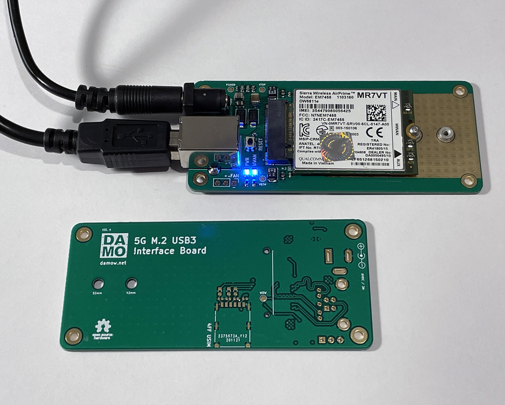

# 5G M.2 USB3 Interface Board

I’ve been experimenting with 5G cellular modules recently, and found that many of the M.2 break-out boards that run on just USB power (mostly designed for 4G modules) can’t supply the required current at the peaks during transmission. I decided to design my own in KiCad with dual-power input, Nano-SIM slot, and USB 3 to support the required data rates for 5G. 

I'm using mine with a Quectel [RM500Q-GL](https://www.quectel.com/product/rm500q.htm) 5G module that I've previously [blogged about](https://damow.net/5g-home-broadband/). The design very much obeys the appnote recommendations for the RM500Q-GL module so use with that one especially should work fine.

## Features

* Compact size, 90mm x 40mm board size; with 82mm x 32mm spaced M2.5 mounting holes
* USB 3.0 SuperSpeed for high 5G data rates
* Dual-power input.
    * USB 3.0 B (not recommended for heavy data use, but fine for lower-end modules)
    * 5-9V DC 5.5mm barrel jack (centre-positive)
* Fits both 52mm and 42mm M.2 B-Key modules
* Single 4FF Nano-SIM USIM slot
* Module reset button
* Module WWAN LED
* Power LED
* 5V 3-pin fan header

## Stackup & BOM

4 layers. Standard FR4. ENIG recommended for easier soldering of the fine-pitch parts (M.2 connector & TPS82130SILR DC-DC converter)

BOM can be found in the `bom/` directory. Currency is GBP. Total build cost (excluding non-special caps & resistors) is ~£15 in 10qty.

## Questions?

Open an issue or drop me an email - `me@` my blog domain.
